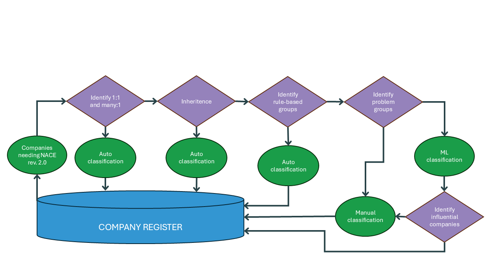

__Open the associated notebook__: <a href="https://datalab.sspcloud.fr/launcher/ide/vscode-python?name=Notebook1&version=2.3.19&s3=region-79669f20&init.personalInit=«https%3A%2F%2Fraw.githubusercontent.com%2FAIML4OS%2FAIML4OS-template-quarto-python%2Frefs%2Fheads%2Fmain%2Fsspcloud%2Finit-trainees.sh»&init.personalInitArgs=«notebooks%2Fnotebook1.ipynb»&git.repository=«https%3A%2F%2Fgithub.com%2FAIML4OS%2FAIML4OS-template-quarto-python.git»&autoLaunch=true" target="_blank" rel="noopener" data-original-href="https://datalab.sspcloud.fr/launcher/ide/vscode-python?name=Notebook1&version=2.3.19&s3=region-79669f20&init.personalInit=«https%3A%2F%2Fraw.githubusercontent.com%2FAIML4OS%2FAIML4OS-template-quarto-python%2Frefs%2Fheads%2Fmain%2Fsspcloud%2Finit-trainees.sh»&init.personalInitArgs=«notebooks%2Fnotebook1.ipynb»&git.repository=«https%3A%2F%2Fgithub.com%2FAIML4OS%2FAIML4OS-template-quarto-python.git»&autoLaunch=true"></a>

# Pipeline overview

# Example notebook
An example notebook is provided for pipline for predicting the back-classification. To run the example, use the following [link to the model prediction notebook on SSPcloud](https://datalab.sspcloud.fr/launcher/ide/vscode-python?name=NACE-backclassification-prediction&version=2.5.6&s3=default&persistence.size=«15Gi»&init.personalInit=«https%3A%2F%2Fraw.githubusercontent.com%2FAIML4OS%2FWP10-cluster5-backclassification%2Frefs%2Fheads%2Fmain%2Finit.sh»&init.personalInitArgs=«notebooks%2F02_back_classification.ipynb»&git.repository=«https%3A%2F%2Fgithub.com%2FAIML4OS%2FWP10-Cluster5-backclassification.git»&networking.user.enabled=true&autoLaunch=true).

